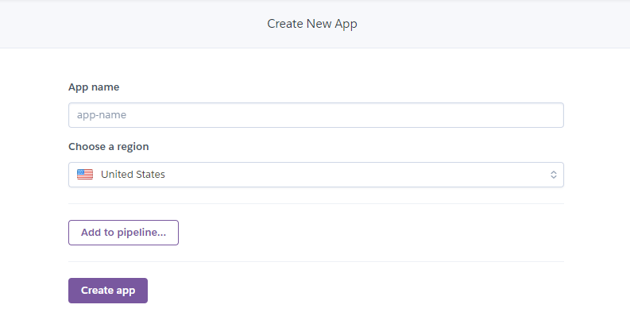

# BÀI THU HOẠCH CHƯƠNG 4 - HỌC PHẦN : ĐIỆN TOÁN ĐÁM MÂY VÀ ỨNG DỤNG
- Sinh viên thực hiện : Mai Thế Long
- Mã sinh viên : 1821050722
- Mục tiêu : Tạo ra một tài liệu hướng dẫn triển khai ứng dụng web trên nền tảng dịch vụ điện toán đám mây.
## Giới thiệu
**Heroku Web App** là một nền tảng đám mây cho phép các lập trình viên xây dựng, triển khai, quản lý và mở rộng ứng dụng (Paas - Platform as a service). Chúng ta có thể liên kết với tài khoản github để dễ dàng thay đổi thực hiện ngay trong **Github Actions**.
Trong bài viết này tôi sẽ tạo ra một "tài liệu" hướng dẫn các bạn tiến hành xây dụng một ứng dụng web và triển khai nó theo giải pháp điện toán đám mây **Heroku**.

Đây là ứng dụng mà tôi sẽ xây dựng trong bài viết này.

Sau khi xem xong "tài liệu" này thì bạn sẽ thực hiện được một số việc với Heroku.

## Mở đầu
Heroku cung cấp dịch vụ máy chủ đám mây giúp dễ dàng trong việc deploy ứng dụng. Điều tuyệt vời ở Heroku là trang này bạn có thể sử dụng dịch vụ hoàn toàn miễn phí với các ứng dụng web không yêu cầu phải có tốc độ truy câp dung lương lớn.
Trong bài viết này chúng ta sẽ cùng làm với nhau 4 việc :
- Tải Heroku CLI
- Tạo một dự án trên Heroku
- Cấu hình Git server repository cho phía local
- Deploy ứng dụng

## Điều kiện tiên quyết
- Có tài khoản [GitHub](https://github.com/)
- Có tài khoản [Heroku](https://dashboard.heroku.com/)
- Môi trường viết mã [Visual Studio Code](https://code.visualstudio.com/)

## Tải Heroku CLI
Các bạn truy cập vào đường link [The Heroku CLI](https://devcenter.heroku.com/articles/heroku-cli) để tải Heroku CLI về máy. Chọn các phiên bản phù hợp với thiết bị của bạn. Có rất nhiều phiên bản để các bạn lựa chọn.

## Tạo dự án trên Heroku
Để tạo dự án trên *Heroku*, bạn cần tạo một tài khoản (hoàn toàn miễn phí) sau đó kích hoạt và đăng nhập vào địa chỉ [https://dashboard.heroku.com/](https://dashboard.heroku.com/). Sau khi đăng nhập vào địa chỉ này, bạn sẽ thấy một nút New dùng để tạo một dự án. Click vào sau đó chọn Create New App :

Trong mục *App Name* chọn tên cho ứng dụng nếu bạn để trống thì Heroku sẽ chọn ngẫu nhiên một tên cho ứng dụng của bạn. Tiếp theo có hai lựa chọn để chọn vùng cho server Heroku sẽ host ứng dụng là Mỹ và Châu Âu. Với các ứng dụng ở Việt Nam tôi khuyên các bạn nên chọ khu vực *Europe* để có thể nâng cao tốc độ truy cập. Sau đó các bạn chọn *Create app*.

## Tạo Git Repository trên máy Local
Đầu tiên các bạn tải cho tôi phần mềm GIT để thuận tiện cho việc deploy ứng dụng web. Đường link để tải tôi sẽ để tại đây [ Click vào đây để download GIT về máy tính](https://git-scm.com/)

Nếu bạn chưa có, hãy đăng nhập vào tài khoản Heroku của bạn và làm theo lời nhắc để tạo kháo công khai SSH mới :

Bây giờ trên máy tính local, chúng ta cần khởi tạo Git local repository (hay local repo). Local repo giống như một cái kho, nơi chứa source code mà bạn sẽ dùng để phát triển ứng dụng. Trên terminal di chuyển tới thư mục ở máy tính của bạn và chạy câu lệnh sau :

Câu lệnh này dùng để khởi tạo một dự án Git ở trên máy tính local. Tiếp theo chạy câu lệnh sau để xem trạng thái (status) của các file trên local repo này :

Bạn sẽ thấy kết quả như sau :

png
Tiếp theo chạy câu lệnh sau để thêm tất cả các file có trong thư mục dự án vào Git :

Chạy *git status* một lần nữa để kiểm tra trạng thái của các file. Lúc này bạn sẽ thấy Git đánh dấu các file vừa được thêm bằng màu khác với trước đó.
Cuối cùng, chúng ta hãy tạo một commit đầu tiên sử dụng câu lệnh :

Giải thích câu lệnh này, -m được sử dụng để tạo message cho commit. Message này thường là nội dung tóm tắt mô tả khi commit thay đổi những gì trong source code. Bạn có thể đặt bất cứ tên nào cũng được. Hãy đặt những massage đơn giản và dễ nhớ nhé.

## Deploy ứng dụng

Có thể có nhiều cách để Deploy ứng dụng lên Heroku nhưng có hai cách thông dụng và dễ thực hiện đó là sử dụng Heroku CLI như tôi vừa trình bày ở bên trên và một cách nữa là bạn có thể kết nối với Github rồi Deploy ứng dung web lên Heroku. Có một lời khuyên cho bạn là khi bạn mới bắt đầu triển khai ứng dụng lên dịch vụ điện toán đám mây - ở đây là Heroku thì bạn nên dùng cách thủ công đó là sử dụng Heroku CLI. Sau khi bạn đã Push được ứng dụng lên một cách thuận lợi thì từ những lầ sau bạn hãy thực hiện cách số hai là deploy thông qua liên kết với Github để đỡ nảy sinh nhiều bugs (lỗi thường gặp phải là sai nhánh Github).

Chúng ta bắt đầu với cách deploy khi kết nối với Github bạn sẽ chọn kho lưu trữ (repositories) chứa source code mà bạn đã push lên Github rồi kết nối chúng với nhau :

 Ở đây tôi đã kết nối thành công.

Tiếp đến bạn cần chọn nhánh của Github để deploy sau đó chọn **Deploy Branch** để đưa ứng dụng lên Heroku.

Sau khi push thành công bạn có thể xem. Click vào **View** sẽ đưa bạn đến trang ứng dụng web mà bạn đã triển khai thành công trên Heroku. 

Chúng ta chuyển sang trang Github, sau khi đã triển khai thành công bạn có thể mở ngay tại đây. Chọn vào kho lưu trữ mà bạn đã kết nối với Heroku -> vào phần code sẽ có mục **Environments** ở dưới cùng phía bên phải màn hình.

Click vào mục này bạn sẽ được đưa sang một trang mới chọn **View deployment** để mở ứng dụng bạn đã triểm khai thành công trên Heroku.

**Cảm ơn các bạn đã theo dõi tài liệu của tôi. Chúc các bạn thành công !!!**